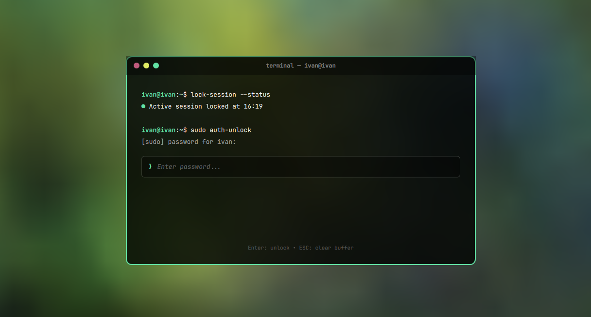

# Omarchy Terminal Lock Screen Plugin

Interactive terminal-styled session lock screen plugin for Omarchy Linux (Quickshell / Hyprland).



---

## Features

- Terminal Window Design: Outer frame with window controls and title bar (terminal — user@host).
- Interactive Prompt Simulation:
  - user@host:~$ lock-session --status
  - Active session locked at HH:mm
  - user@host:~$ sudo auth-unlock
  - [sudo] password for user:
  - Prompt arrow with password masking.
- Integrated PAM Authentication: Full password and fingerprint PAM support via Omarchy Quickshell.
- Theme Aware: Inherits system accent colors, wallpaper blur, and font styling from the active Omarchy theme.
- Shortcuts: ESC or Ctrl+U to clear buffer, Enter to submit.

---

## Installation

On any machine running Omarchy Linux (v4 / Quattro or later), install and enable the plugin with:

```bash
omarchy plugin add https://github.com/ivanmercedes/omarchy-terminal-lock.git --enable --yes
```

---

## Usage

### Test Lock Screen Preview
```bash
omarchy-shell lock preview
```

### Lock the System
```bash
omarchy system lock
```
(Or use keyboard shortcut: SUPER + CTRL + L)

### Update Plugin
```bash
omarchy plugin update ivanmercedes.terminal-lock
```

### Remove Plugin
```bash
omarchy plugin remove ivanmercedes.terminal-lock
```

---

## License

MIT
